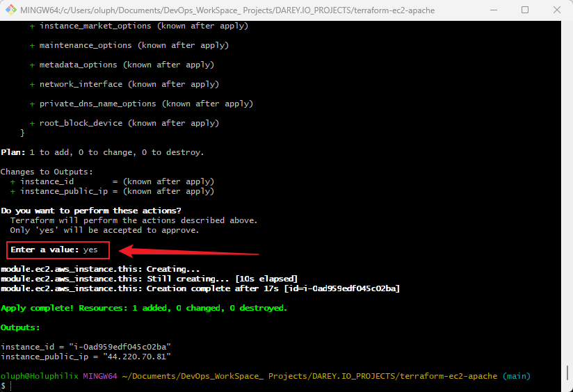

# 🌐 Mini Project: EC2 Module and Security Group Module with Apache2 UserData

## 📖 Overview

This project demonstrates the use of **modular Terraform configuration** to provision a secure and automated AWS infrastructure. The infrastructure includes:

- An **EC2 instance** deployed using a reusable **Terraform EC2 module**
- A **Security Group** created using a separate Terraform module
- An automated **Apache2 web server setup** using EC2 **UserData**

This repository follows **best practices** for infrastructure as code (IaC) with reusable, scalable, and production-ready Terraform modules.

## 📁 Project Directory

```bash
terraform-ec2-apache/
├── modules/
│   ├── ec2/
│   │   ├── main.tf                  # EC2 instance configuration
│   │   ├── variables.tf             # Variables for EC2 module
│   │   └── output.tf                # Outputs for EC2 module
│   ├── security_group/
│   │   ├── main.tf                  # Security group configuration
│   │   ├── variables.tf             # Variables for security group module
│   │   └── output.tf                # Outputs for security group module
│   └── vpc/
│       ├── main.tf                  # VPC configuration
│       ├── variables.tf             # Variables for VPC module
│       └── output.tf                # Outputs for VPC module
├── terraform.tfvars                 # Project-specific variables
├── main.tf                          # Root configuration
├── provider.tf                      # Provider configurations (AWS)
├── variables.tf                     # Variables for root configuration
├── outputs.tf                       # Outputs for root configuration
├── apache_userdata.sh               # UserData script to install Apache2
├── .gitignore                       # Git ignore file for Terraform
├── README.md                        # Project documentation
└── .terraform/                      # Terraform state and working files
```

## 🚀 Getting Started

### 📂 Clone the Repository

```bash
git clone https://github.com/Holuphilix/terraform-ec2-apache.git
cd terraform-ec2-apache
```

## 🧰 Prerequisites

Ensure the following are installed and configured:

- [Terraform](https://developer.hashicorp.com/terraform/downloads) ≥ v1.0.0  
- [AWS CLI](https://docs.aws.amazon.com/cli/latest/userguide/install-cliv2.html) configured with:
  
  ```bash
  aws configure
  ```

- An **existing AWS Key Pair** in your target region
- IAM credentials with permissions to create:
  - EC2 instances
  - Security groups
  - Subnets (if custom networking is added)

## 🧩 Task 1: EC2 Module

### ✅ Objective

Create a reusable Terraform module for provisioning an EC2 instance.

### 📦 Module: `modules/ec2/main.tf`

```hcl
resource "aws_instance" "this" {
  ami                    = var.ami
  instance_type          = var.instance_type
  subnet_id              = var.subnet_id
  vpc_security_group_ids = [var.security_group_id]
  key_name               = var.key_name

  user_data              = file("${path.module}/../../apache_userdata.sh")

  tags = {
    Name = var.instance_name
  }
}
```

### 📄 Module: `modules/ec2/variables.tf`

```hcl
variable "ami" {
  description = "AMI ID to use for the instance"
  type        = string
}

variable "instance_type" {
  description = "Instance type"
  type        = string
}

variable "key_name" {
  description = "EC2 Key pair name"
  type        = string
}

variable "subnet_id" {
  description = "Subnet ID to launch the instance in"
  type        = string
}

variable "security_group_id" {
  description = "Security Group ID to associate with the instance"
  type        = string
}

variable "instance_name" {
  description = "Tag Name for the EC2 instance"
  type        = string
}
```

### 📤 Module: `modules/ec2/outputs.tf`

```hcl
output "instance_id" {
  value = aws_instance.this.id
}

output "instance_public_ip" {
  value = aws_instance.this.public_ip
}
```

## ✅ TASK 2: SECURITY GROUP MODULE 

### 🎯 Goal

Create a reusable Terraform module that provisions a **Security Group** for your EC2 instance. The security group will allow:

- **SSH (port 22)** access from your IP or anywhere (for learning/demo purposes)
- **HTTP (port 80)** access for Apache2 from the internet

### 📄 `modules/security-group/main.tf`

```hcl
resource "aws_security_group" "this" {
  name        = "apache2-ec2-sg"
  description = "Security Group for Apache2 EC2 instance"
  vpc_id      = var.vpc_id

  ingress {
    description = "Allow SSH"
    from_port   = 22
    to_port     = 22
    protocol    = "tcp"
    cidr_blocks = [var.allowed_ssh_cidr]
  }

  ingress {
    description = "Allow HTTP"
    from_port   = 80
    to_port     = 80
    protocol    = "tcp"
    cidr_blocks = ["0.0.0.0/0"]
  }

  egress {
    description = "Allow all outbound traffic"
    from_port   = 0
    to_port     = 0
    protocol    = "-1"
    cidr_blocks = ["0.0.0.0/0"]
  }

  tags = {
    Name = "Apache2-EC2-SG"
  }
}
```

### 📄 `modules/security-group/variables.tf`

```hcl
variable "vpc_id" {
  description = "The VPC ID where the security group will be created"
  type        = string
}

variable "allowed_ssh_cidr" {
  description = "CIDR block allowed to access via SSH"
  type        = string
}
```

### 📄 `modules/security-group/outputs.tf`

```hcl
output "security_group_id" {
  description = "The ID of the created Security Group"
  value       = aws_security_group.ec2_sg.id
}
```
### ✅ VPC Setup MODULE

Create a reusable Terraform module for provisioning an VPC Setup.

### 📦 Module: `modules/vpc/main.tf`

```hcl
resource "aws_vpc" "main" {
  cidr_block           = var.vpc_cidr
  enable_dns_support   = true
  enable_dns_hostnames = true

  tags = {
    Name = var.vpc_name
  }
}

resource "aws_subnet" "public" {
  vpc_id                  = aws_vpc.main.id
  cidr_block              = var.public_subnet_cidr
  map_public_ip_on_launch = true
  availability_zone       = var.availability_zone

  tags = {
    Name = "${var.vpc_name}-public-subnet"
  }
}

resource "aws_internet_gateway" "gw" {
  vpc_id = aws_vpc.main.id

  tags = {
    Name = "${var.vpc_name}-igw"
  }
}

resource "aws_route_table" "public" {
  vpc_id = aws_vpc.main.id

  route {
    cidr_block = "0.0.0.0/0"
    gateway_id = aws_internet_gateway.gw.id
  }

  tags = {
    Name = "${var.vpc_name}-public-rt"
  }
}

resource "aws_route_table_association" "public" {
  subnet_id      = aws_subnet.public.id
  route_table_id = aws_route_table.public.id
}
```

### 📄 Module: `modules/vpc/variables.tf`

```hcl
variable "vpc_name" {
  description = "Name of the VPC"
  type        = string
}

variable "vpc_cidr" {
  description = "CIDR block for the VPC"
  type        = string
}

variable "public_subnet_cidr" {
  description = "CIDR block for the public subnet"
  type        = string
}

variable "availability_zone" {
  description = "Availability zone for the public subnet"
  type        = string
}
```

### 📤 Module: `modules/vpc/outputs.tf`

```hcl
output "vpc_id" {
  value = aws_vpc.main.id
}

output "public_subnet_id" {
  value = aws_subnet.public.id
}
```

## ✅ Task 3: UserData Script for Apache2

### 🔹 Step 1: Create UserData Script File

Create a file at the root of your project directory named `apache_userdata.sh`:

#### 📄 `apache_userdata.sh`
```bash
#!/bin/bash
# Update package list
sudo apt-get update -y

# Install Apache2
sudo apt-get install apache2 -y

# Enable Apache2 service to start on boot
sudo systemctl enable apache2

# Start Apache2 service
sudo systemctl start apache2

# Create a custom index.html
echo "<html><body><h1>Deployed with Terraform and Apache2</h1></body></html>" | sudo tee /var/www/html/index.html
```

- ✅ This script installs Apache2, ensures it runs on boot, and places a custom landing page.

### 🔹 Step 2: Make the Script Executable

Run this in your terminal before applying Terraform (you’ll do this in **Task 5**):

```bash
chmod +x apache_userdata.sh
```

### 🔹 Step 3: Reference in EC2 Module

Update your EC2 module to read and use this UserData file.

#### 📁 `modules/ec2/main.tf` — Updated
```hcl
resource "aws_instance" "this" {
  ami                    = var.ami
  instance_type          = var.instance_type
  subnet_id              = var.subnet_id
  vpc_security_group_ids = [var.security_group_id]
  key_name               = var.key_name

  user_data              = file("${path.module}/../../apache_userdata.sh")

  tags = {
    Name = var.instance_name
  }
}
```

## ✅ Task 4: Main Terraform Configuration

### 📁 `main.tf` (root level)

This file will call both the `security_group`, `vpc`and `ec2` modules:

```hcl
# Security Group Module
module "security_group" {
  source             = "./modules/security_group"
  vpc_id             = module.vpc.vpc_id             # ✅ Refer to created VPC ID
  allowed_ssh_cidr   = var.allowed_ssh_cidr
}

module "vpc" {
  source               = "./modules/vpc"
  vpc_name             = "apache2-vpc"
  vpc_cidr             = "10.0.0.0/16"
  public_subnet_cidr   = "10.0.1.0/24"
  availability_zone    = "us-east-1a" # adjust to your region
}

# EC2 Instance Module
module "ec2" {
  source          = "./modules/ec2"
  ami             = var.ami
  instance_type   = var.instance_type
  key_name        = var.key_name
  subnet_id       = var.subnet_id
  security_group_id = module.security_group.security_group_id
  instance_name   = var.instance_name
}
```

### 🧠 Explanation:

| Component          | Purpose                                                                 |
|--------------------|-------------------------------------------------------------------------|
| `module "security_group"` | Provisions a security group using your custom module.             |
| `module "ec2"`            | Provisions the EC2 instance and injects UserData for Apache setup.|
| `module.security_group.security_group_id` | Uses the output from the SG module as input to the EC2 module.|

### 🌐 Providers: `provider.tf`

```hcl
provider "aws" {
  region = "us-east-1" # or your preferred region
}
```

### `variables.tf` in the root with all required inputs.

```hcl
#================= EC2 Instance Inputs =================#

variable "ami" {
  description = "AMI ID for the EC2 instance"
  type        = string
}

variable "instance_type" {
  description = "EC2 instance type"
  type        = string
}

variable "key_name" {
  description = "Key pair name for SSH access"
  type        = string
}

variable "subnet_id" {
  description = "Subnet ID where the EC2 instance will be launched"
  type        = string
}

variable "security_group_id" {
  description = "Security Group ID for the EC2 instance (usually provided by the SG module)"
  type        = string
  default     = null # Will be dynamically set via module output
}

variable "instance_name" {
  description = "Name tag for the EC2 instance"
  type        = string
}

#================= Security Group Inputs =================#

variable "vpc_id" {
  description = "The ID of the VPC where the Security Group will be created"
  type        = string
}

variable "allowed_ssh_cidr" {
  description = "CIDR block allowed to SSH into the instance"
  type        = string
  default     = "0.0.0.0/0"
}

variable "vpc_name" {}
variable "vpc_cidr" {}
variable "public_subnet_cidr" {}
variable "availability_zone" {}
```

### `terraform.tfvars` with actual values like:
  
  ```hcl
ami               = "ami-084568db4383264d4"     # Ubuntu 22.04 LTS
instance_type     = "t2.micro"
key_name          = "Ecommerce_Platform"        # Use your existing key pair
subnet_id         = "subnet-09eab4f79055c41f8"  # Replace with your actual Subnet ID
vpc_id            = "vpc-003aa77d967805512"    # ✅ Actual VPC ID
allowed_ssh_cidr  = "0.0.0.0/0"                 # ⚠️ Open SSH to all — restrict in production
instance_name     = "Apache2-EC2-Instance"
vpc_name          = "apache2-vpc"
vpc_cidr          = "10.0.0.0/16"
public_subnet_cidr = "10.0.1.0/24"
availability_zone = "us-east-1a"
  ```

### `output.tf` with show values like:

```hcl
output "instance_id" {
  description = "The ID of the EC2 instance"
  value       = module.ec2.instance_id
}

output "instance_public_ip" {
  description = "The public IP address of the EC2 instance"
  value       = module.ec2.instance_public_ip
}
```

## ✅ Task 5: Deployment Instructions

Once you’ve completed all previous tasks, follow these steps to **initialize** and **apply** your Terraform configuration to deploy the EC2 instance with Apache2.


### 🧱 Step 1: Initialize the Project

Run this command to initialize the Terraform working directory and download all required providers and modules:

```bash
terraform init
```

### 🧠 Step 2: Validate Your Configuration (Optional but Recommended)

Check your configuration for syntax errors and ensure it's valid:

```bash
terraform validate
```

### 📝 Step 3: Review the Execution Plan

This shows you what resources will be created or updated:

```bash
terraform plan
```

### 🚀 Step 4: Apply the Configuration

This step provisions all the infrastructure you've defined:

```bash
terraform apply
```

Type `yes` when prompted to confirm the deployment.



### 🔍 Step 5: Verify Apache2 Installation

After Terraform completes:

1. Go to your AWS Console → EC2 Dashboard.
2. Locate your instance (you can use the name tag `Apache2-EC2-Instance`).
3. Copy the **public IP address** from the outputs or console.
4. Paste it into your browser:

```text
http://44.220.70.81
```


If Apache2 was installed successfully, you should see the **Apache2 Ubuntu Default Page**.

✅ You’ve now successfully deployed an EC2 instance using modular Terraform code with a custom Security Group and Apache2 installed via UserData!

## Task 6: Git Version Control

This project uses Git for version control and GitHub as the remote repository to manage infrastructure code, track changes, and collaborate effectively.

#### ✅ Steps Taken:

1. **Initialize the Git Repository**  
   The project was initialized as a Git repository:

   ```bash
   git init
   ```

2. **Configure Git (Optional but recommended)**

   ```bash
   git config --global user.name "holuphilix"
   git config --global user.email "oluphilix@gmail.com"
   ```

3. **Create and Configure `.gitignore`**  
   A `.gitignore` file was created to avoid committing sensitive or unnecessary files:

   ```bash
   touch .gitignore
   ```

   **Contents of `.gitignore`:**

   ```gitignore
   # Terraform files
   .terraform/
   *.tfstate
   *.tfstate.*
   crash.log
   crash.*
   terraform.tfvars
   terraform.tfvars.json
   *.backup
   .terraform.lock.hcl

   # Editor and OS files
   .vscode/
   .idea/
   *.swp
   *~
   *.bak
   *.tmp
   .DS_Store
   Thumbs.db
   ```

4. **Stage and Commit Files**

   ```bash
   git add .
   git commit -m "Initial commit - Terraform project for Apache2 EC2 deployment"
   ```

5. **Push to GitHub**

   The local repository was linked to the remote GitHub repo and pushed:

   ```bash
   git remote add origin https://github.com/Holuphilix/terraform-ec2-apache.git
   git branch -M main
   git push -u origin main
   ```